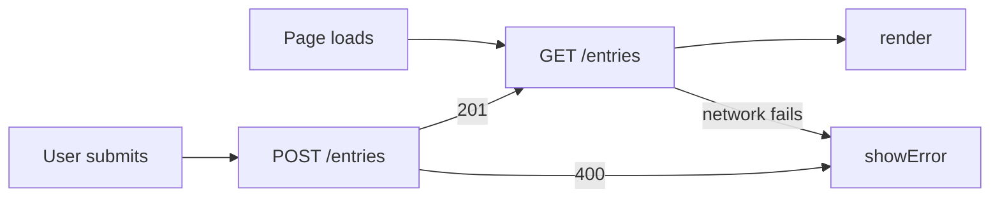
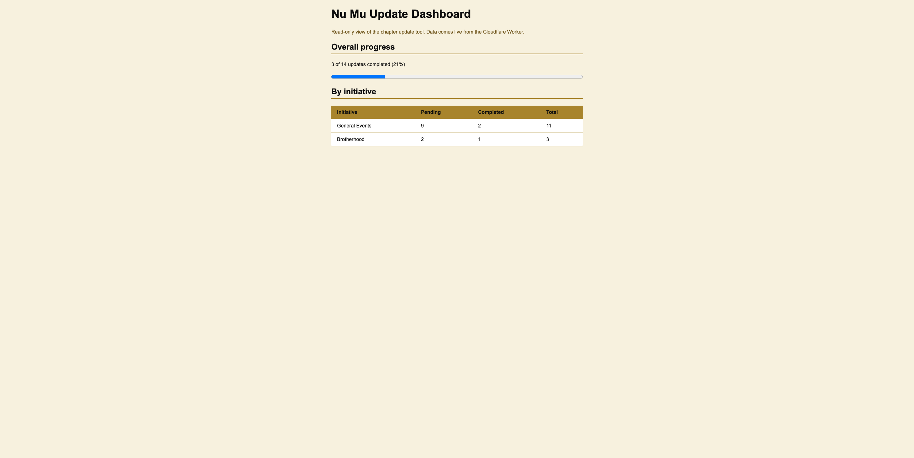
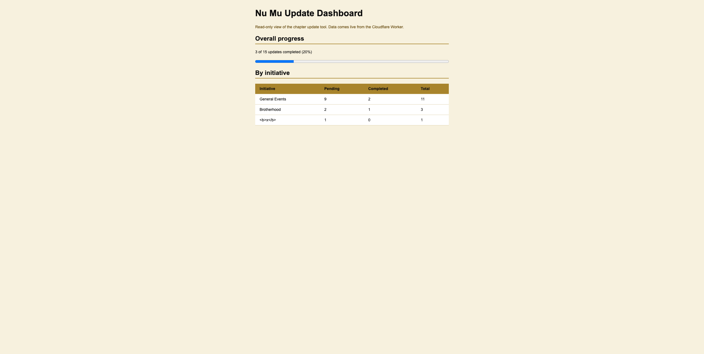
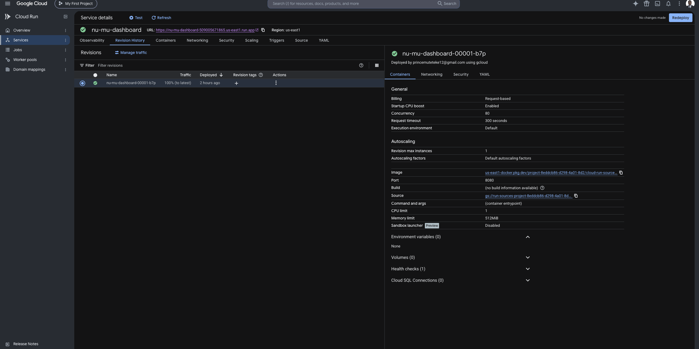
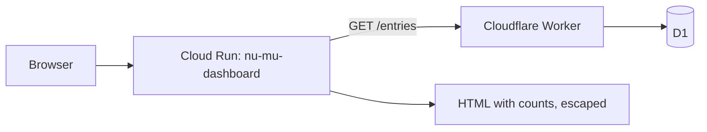

# Entries: The First Delegated Feature

## What

*HW4 repository: (https://github.com/YOUR-USER/mgt3745-hw4)*

*One paragraph naming the problem, the user, and the feature, with links to
[PROJECT.md](context/PROJECT.md) and [FEATURES.md](context/FEATURES.md).
One sentence on where data now lives and why (ADR-002).*

## See It Work

*A GIF or screenshot in `/docs` showing an entry surviving a cleared cache
or appearing in a second browser. Evidence and storefront at once.*

## How to Run

Deployed: *`https://mgt3745-hw4.YOUR-SUBDOMAIN.workers.dev/entries`*

From a fresh Codespace:

1. Open the repository in a Codespace. The devcontainer installs xdg-utils and runs `npm install`.
2. `npx wrangler login --device`, then follow [docs/SESSION_B_COMMANDS.md](docs/SESSION_B_COMMANDS.md)
   to create the database, run the schema, and deploy.
3. Paste the deployed URL into `app.js` as `API`.
4. Right-click `index.html`, choose **Open with Live Server**.

Run the code eval: `API=https://mgt3745-hw4.YOUR-SUBDOMAIN.workers.dev npm test`

To run the Worker locally instead: `npm run dev` (port 8787, local D1 emulator).

## Status

| Feature | EARS statement | Verdict |
|---|---|---|
| *Save an entry* | *WHEN a valid entry is submitted, THE SYSTEM SHALL store it* | *PASS* |
| *Reject empty entry* | *IF text is missing, THEN THE SYSTEM SHALL reject with a reason* | *PASS* |
| *Survive cleared cache* | *THE SYSTEM SHALL return stored entries on any device* | *PASS* |
| *Network down* | *IF the server is unreachable, THE SYSTEM SHALL tell the user* | *CANNOT TEST YET* |
| *Two clients, one table* | *...* | *DEFERRED (ADR-002)* |

*Full verification table lives in [FEATURES.md](context/FEATURES.md).*

## Delegation

- [DDR-001](docs/DDR-001.md): *feature, tool, net hours*
- [DDR-002](docs/DDR-002.md): *the HW4 Copilot delegation, written up*
- [Comparison note](docs/COMPARISON.md)

## Links

Reading order for a stranger: [PROJECT.md](context/PROJECT.md) →
[USERS.md](context/USERS.md) → [FEATURES.md](context/FEATURES.md) →
[ARCHITECTURE.md](context/ARCHITECTURE.md) → [STANDARDS.md](context/STANDARDS.md) →
[TOOLS.md](context/TOOLS.md) → [STYLE.md](context/STYLE.md) →
[EVALS.md](context/EVALS.md) → [SKILLS.md](context/SKILLS.md) → [CLAUDE.md](context/CLAUDE.md)

## AI Use

*Every delegation has a DDR under Delegation above. Hours spent on this assignment: ___.*

*Retired text: Three prot# Nu Mu Update Dashboard: Cloud Run Bonus (5C Medium)

## What

HW5 repository (frozen for grading): [https://github.com/Daedruoy/mgt3745-hw5](https://github.com/Daedruoy/mgt3745-hw5)

This bonus asks whether the Nu Mu chapter update tool should graduate from its Cloudflare Worker and D1 database to Google Cloud Run. I decided it should not, and recorded that in a provisional ADR-003 in [ARCHITECTURE.md](context/ARCHITECTURE.md), written and committed before I built anything. To test the graduation path I deployed one small Cloud Run service: a read-only HTML dashboard that fetches `GET /entries` from my live Worker and shows pending and completed counts per initiative. The Worker and D1 stay the backend. See [PROJECT.md](context/PROJECT.md) and [FEATURES.md](context/FEATURES.md) for the problem and the tool itself.

## See It Work

Live URL: [https://nu-mu-dashboard-509005671865.us-east1.run.app](https://nu-mu-dashboard-509005671865.us-east1.run.app)

Project status: If the dashboard is deleted, rely on the screenshots below.

Commit order: ADR-003 is commit `d5bcbca`, and the dashboard is commit `f21a3f3`.

## How to Run

Needs a Google Cloud project with a billing account (trial credit worked for me). No API keys are used or needed.

In Cloud Shell, with your project selected:

1. `gcloud services enable run.googleapis.com cloudbuild.googleapis.com artifactregistry.googleapis.com`
2. Grant the default Compute Engine service account the `roles/cloudbuild.builds.builder` role on the project. My first deploy failed until I did this.
3. Clone this repository and change into `dashboard/`.
4. `gcloud run deploy nu-mu-dashboard --source . --region us-east1 --allow-unauthenticated --max-instances=1`

To run it locally: `cd dashboard && npm install && npm start`. The service reads the Worker URL from the `WORKER_URL` environment variable and falls back to my deployed Worker.

When finished, delete the project so the service, image, and repository go with it.

## Status

| Question | Answer |
|---|---|
| Does the deployment do what ADR-003 says it does? | Yes. It is deployed, it reads from the live Worker, it renders an HTML dashboard, and it never writes to the Worker. |

| Check | Result |
|---|---|
| Dashboard counts match the Worker's raw output (14 updates, 3 completed) | Pass, by hand |
| Escaping: initiative `<b>x</b>` renders as literal text | Pass, by hand |
| ADR-003 committed before the build | Pass, see commit hashes above |
| Actual charges after the deploy | [fill in after checking Billing, Reports] |
| Transitive dependencies audited | Not done |
| Automated tests for the dashboard | None written |

## Delegation

- [DDR-003](docs/DDR-003.md): the dashboard code, written with Claude, with the vibe coding paragraph.

## Links

Reading order for a stranger: [PROJECT.md](context/PROJECT.md) → [USERS.md](context/USERS.md) → [FEATURES.md](context/FEATURES.md) → [ARCHITECTURE.md](context/ARCHITECTURE.md) (ADR-003) → [STANDARDS.md](context/STANDARDS.md) → [TOOLS.md](context/TOOLS.md) → [STYLE.md](context/STYLE.md) → [EVALS.md](context/EVALS.md) → [SKILLS.md](context/SKILLS.md) → [CLAUDE.md](context/CLAUDE.md)

## AI Use

The dashboard code was delegated, and DDR-003 records what I delegated, what I checked, and what I changed. Hours spent on this bonus: 4.o-DDR questions. What did the agent write? What did you check,
and how? What could you not fully verify, and what did you do about it?
For the Worker specifically: name the thing you could not fully inspect.
Hours spent: 4.*
