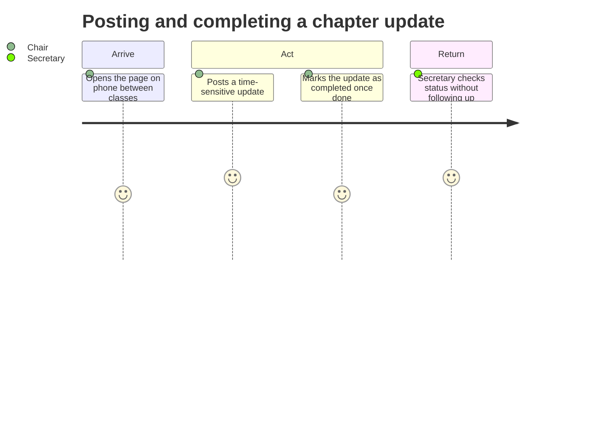

# USERS

Status: ACTIVE.

### INT-01
INT-01 — general chapter member, no officer role, commutes from home rather than living near campus — 09/07

Convocation practice start times were decided and shared informally in the casual brother chat rather than posted to the official chapter calendar, sometimes leaving him as little as an hour's notice, which is difficult to act on given his commute. Chapter dues messaging was also released in an incomplete first pass, without payment details or deadline, requiring a second release before he could act. His workaround is checking group chats once daily, typically in the afternoon before heading home, and depending on reminders rather than tracking deadlines himself.

Reported: missed Convocation timing, incomplete dues messaging, daily-check habit, reliance on reminders, difficulty distinguishing fresh from buried messages, follow-up needed on photoshoot attire details. Inferred: that he is more affected by this than a brother living on or near campus, since his single daily check window has less room to catch late-breaking, informally shared updates.

Confirms Framing A's underlying assumption that oversight is uneven, but also surfaces something Framing A doesn't name directly: the breakdown isn't really about brothers being overcommitted (the stakeholder-shift framing); it's about where and how information gets posted. This pushes toward a scope question the chosen framing did not succeed in asking.

### INT-02
INT-02 — Chapter Secretary, responsible for meeting minutes and a self-started weekly newsletter — 09/08

Because he takes minutes during chapter meetings, he cannot gather newsletter content live and instead reconstructs it afterward from the minutes, his roommates (all brothers of the chapter), and direct outreach to specific brothers. A stepshow practice date was reported incorrectly in the newsletter because the stepmaster communicated the update verbally and privately rather than posting it anywhere official. His workaround for reminders is instinct-based and more of a personal art than a science: he sends one when he senses a topic hasn't been mentioned recently, with no defined trigger.

Reported: manual 20-minute compilation process using a copied template and two calendars, privately messaging brothers for details not shared publicly, chasing chairs (e.g., community service chair) to confirm tasks are actually completed, no way to see who has or hasn't acted on something until after the fact. Inferred: that his dual role (minute-taker and newsletter compiler) structurally limits his ability to gather information live; this wasn't stated outright but follows directly from the described conflict.

Confirms the same information-placement problem seen in INT-01, from the other side; even the person responsible for accuracy gets it wrong when info isn't posted officially. Challenges Framing A somewhat: the burden here isn't "losing oversight" in the president's sense; it's oversight-adjacent labor (compiling, chasing, guessing at reminders) falling on the secretary instead.

## Two job statements

JOB-01: When I only get to check the group chats once a day before heading home, I want to catch time-sensitive updates before they're buried under newer messages, so I can show up prepared without needing an individual reminder.

Evidence: INT-01

JOB-02: When I can't tell whether brothers have already seen or acted on something I've sent, I want a clear signal of what's actually been missed, so I can decide whether it needs a reminder instead of guessing.

Evidence: INT-02

## Two user profiles

PROFILE-01: General chapter member, no officer role, commutes from home. Needs time-sensitive updates surfaced before they're buried by newer chat messages, especially informally shared details like practice times or event attire. Constrained to roughly one daily check window, typically in the afternoon or evening. Reported: single daily check habit, missed Convocation timing, incomplete dues messaging, follow-up needed on photoshoot details (INT-01). Inferred: commuter status likely worsens the effect of a narrow check window, not directly tested against a non-commuting brother (INT-01).

PROFILE-02: Chapter Secretary, taking minutes at chapter meetings and manually compiling a weekly newsletter from the chapter calendar, NPHC calendar, meeting minutes, and direct outreach. Needs an evidence-based way to know when a reminder is warranted, and a way to see whether brothers have acted on something, rather than finding out after the fact. Constrained by his dual role preventing live info-gathering at chapter, and by information sometimes existing only in private, verbal form. Reported: 20-minute manual compilation process, messaging for missing details, one factual error traced to informal communication, chasing chairs for task completion (INT-02). Inferred: that a more systematic reminder trigger would reduce his current guesswork; he described his process neutrally rather than as a direct complaint (INT-02).

## Journey

